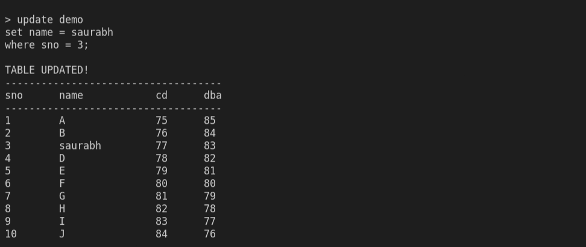
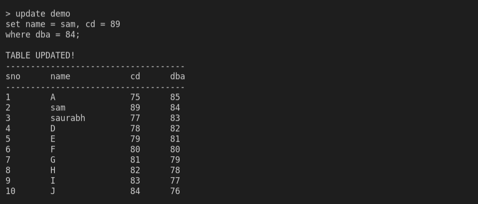
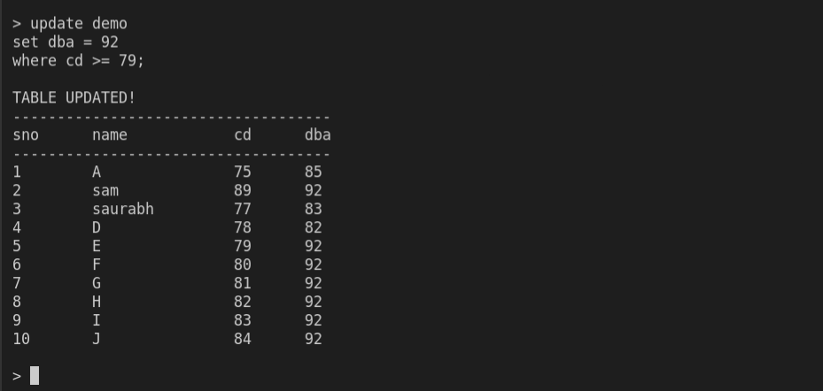
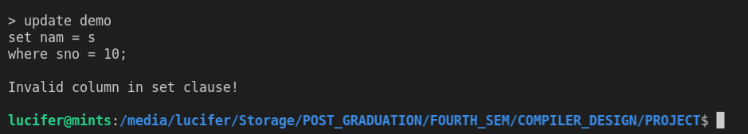

# Parser for SQL UPDATE statement
---
## Description  

A basic parser for parsing SQL UPDATE statement using ***LEX ans YACC***

---

## Assumptions

* This program creates a table ***demo*** with dummy data.
* table structure is as follows:
    sno | name | cd | dba
    ---|---|---|---
*  yylval takes value of type ***char****.
*  There can be ***atmost 1*** condition in ***WHERE*** clause, if present.
*  More than 1 column can be updated at a time.
*  While setting the vlaue of a column with datatype as ***varchar***, quotes are not required.
*  Used ***;*** as a delimiter.
  
---

## Usage

generate ***lex.yy.c file***
```
lex analyzer.l
```

generate ***y.tab.c and y.tab.h files***
```
yacc -d parser.y
```

compile the ***c*** files generated in previous steps
```
gcc lex.yy.c y.tab.c -o out
```
---

## Examples

```
update demo 
set name = saurabh
where sno = 3;
```


```
update demo
set name = sam, cd = 89
where dba = 84;
```


```
update demo 
set dba = 92
where cd >= 79;
```


```
update demo
set nam = s
where sno = 10;
```



